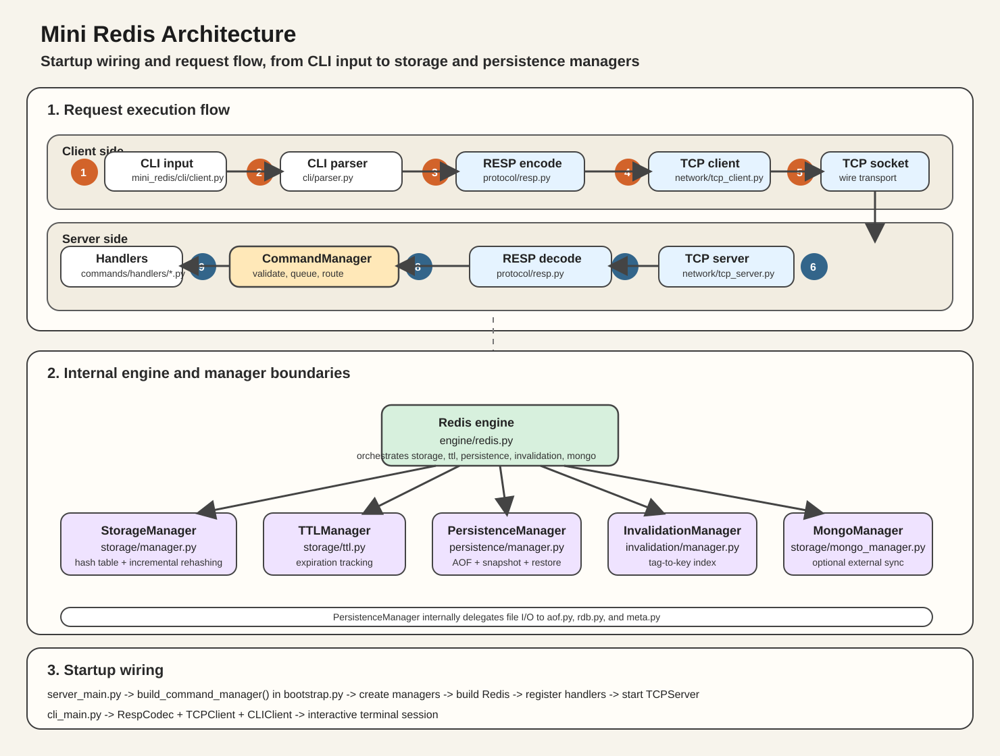

# Mini Redis

Python으로 만든 학습용 Mini Redis 프로젝트입니다. 이 저장소는 단순한 key-value 저장소를 넘어서, `CLI -> TCP -> RESP -> Command Routing -> Redis Engine -> Storage / TTL / Persistence / Invalidation / Mongo` 흐름이 계층적으로 어떻게 분리되는지 보여주는 데 초점을 둡니다.

## Architecture At A Glance



## Request Flow In Order

아래 순서로 읽으면 현재 프로젝트 구조가 가장 빠르게 이해됩니다.

1. 사용자는 `mini-redis-cli`로 명령을 입력합니다.
2. `src/mini_redis/cli/client.py`의 `CLIClient`가 입력을 받고, 로컬 메타 명령인지 서버로 보낼 명령인지 구분합니다.
3. `src/mini_redis/cli/parser.py`가 입력 문자열을 `{"name": "...", "args": [...]}` 형태의 공통 Command 객체로 바꿉니다.
4. `src/mini_redis/protocol/resp.py`의 `RespCodec`가 이 명령을 RESP 바이트로 인코딩합니다.
5. `src/mini_redis/network/tcp_client.py`의 `TCPClient`가 TCP 소켓으로 서버에 전송합니다.
6. 서버는 `src/mini_redis/network/tcp_server.py`에서 요청을 받고, 다시 `RespCodec`으로 RESP를 Command 객체로 디코딩합니다.
7. 모든 서버 명령은 `src/mini_redis/commands/manager.py`의 `CommandManager.execute()`로 들어갑니다.
8. `CommandManager`는 `src/mini_redis/commands/queue.py`의 FIFO `CommandQueue`를 통해 동시 요청 실행 순서를 직렬화합니다.
9. 그다음 명령 이름에 맞는 handler가 선택되고, 각 handler가 인자 검증과 명령별 로직 분기를 담당합니다.
10. handler는 내부 오케스트레이터인 `src/mini_redis/engine/redis.py`의 `Redis` 객체를 호출합니다.
11. `Redis`는 실제 데이터 저장과 부가 기능을 위해 Storage, TTL, Persistence, Invalidation, Mongo 매니저를 조합해 사용합니다.
12. 결과는 다시 RESP 응답으로 인코딩되어 TCP를 통해 CLI로 돌아옵니다.

## Startup Flow

이 프로젝트는 실행 시점에도 구조가 깔끔하게 나뉘어 있습니다.

### Server startup

1. `src/mini_redis/server_main.py`가 서버 시작점입니다.
2. 여기서 `src/mini_redis/bootstrap.py`의 `build_command_manager()`를 호출합니다.
3. `build_command_manager()`는 `StorageManager`, `TTLManager`, `InvalidationManager`, `PersistenceManager`, `MongoManager`를 생성합니다.
4. 이 매니저들을 묶어 `Redis` 엔진을 만듭니다.
5. 각 명령별 handler를 등록한 뒤 `CommandManager`를 생성합니다.
6. 마지막으로 `TCPServer`가 `CommandManager`와 `RespCodec`을 받아 요청 처리를 시작합니다.

### Client startup

1. `src/mini_redis/cli_main.py`가 클라이언트 시작점입니다.
2. `RespCodec`, `TCPClient`, `CLIClient`를 조립합니다.
3. `CLIClient.run()`이 인터랙티브 세션을 시작합니다.

## Directory Map

```text
miniRedis/
|-- img/
|   `-- mini-redis-architecture.svg   # README architecture image
|-- data/                             # runtime persistence files
|-- docs/                             # extra docs / legacy assets
|-- src/
|   `-- mini_redis/
|       |-- cli_main.py               # CLI entrypoint
|       |-- server_main.py            # server entrypoint
|       |-- bootstrap.py              # dependency wiring
|       |-- config.py                 # runtime settings
|       |-- types.py                  # shared Command type
|       |-- cli/
|       |   |-- client.py             # terminal UX
|       |   `-- parser.py             # CLI string -> Command
|       |-- protocol/
|       |   `-- resp.py               # RESP encode/decode
|       |-- network/
|       |   |-- tcp_client.py         # client transport
|       |   |-- tcp_server.py         # server transport
|       |   `-- timing.py             # timed request/response wrapper
|       |-- commands/
|       |   |-- manager.py            # single execution entrypoint
|       |   |-- queue.py              # FIFO serialization
|       |   |-- catalog.py            # HELP metadata
|       |   `-- handlers/             # one file per command family
|       |-- engine/
|       |   `-- redis.py              # internal orchestrator
|       |-- storage/
|       |   |-- manager.py            # in-memory hash table
|       |   |-- ttl.py                # expiration tracking
|       |   |-- mongo_adapter.py      # pymongo boundary
|       |   |-- mongo_manager.py      # mongo policy / info
|       |   `-- benchmark.py          # benchmark helpers
|       |-- invalidation/
|       |   `-- manager.py            # tag index
|       `-- persistence/
|           |-- manager.py            # persistence coordinator
|           |-- aof.py                # append-only log
|           |-- rdb.py                # snapshot store
|           `-- meta.py               # metadata store
`-- tests/                            # CLI / RESP / TCP / command / storage tests
```

## What Each Layer Owns

### 1. CLI layer

- 책임: 입력, 출력, 프롬프트, 로컬 편의 명령 처리
- 핵심 파일: `src/mini_redis/cli/client.py`, `src/mini_redis/cli/parser.py`
- 하지 않는 일: 직접 Redis 엔진 호출, 직접 파일 저장

### 2. Protocol layer

- 책임: RESP 인코딩/디코딩
- 핵심 파일: `src/mini_redis/protocol/resp.py`
- 하지 않는 일: 비즈니스 로직 처리

### 3. Network layer

- 책임: TCP 연결 생성, 요청 수신/응답 전달
- 핵심 파일: `src/mini_redis/network/tcp_client.py`, `src/mini_redis/network/tcp_server.py`
- 하지 않는 일: 명령 해석, storage 접근

### 4. Command layer

- 책임: 명령 진입점 통일, FIFO 실행, handler 라우팅
- 핵심 파일: `src/mini_redis/commands/manager.py`, `src/mini_redis/commands/queue.py`, `src/mini_redis/commands/handlers/`
- 핵심 포인트: 서버 쪽 명령 실행은 항상 `CommandManager`를 통과합니다.

### 5. Engine layer

- 책임: 여러 내부 매니저를 묶어서 한 번의 명령을 완성
- 핵심 파일: `src/mini_redis/engine/redis.py`
- 핵심 포인트: `Redis`는 저장, TTL, persistence, invalidation, mongo를 조합하는 오케스트레이터입니다.

### 6. Data/manager layer

- `StorageManager`: 메모리 해시 테이블과 incremental rehashing
- `TTLManager`: 만료 시각 추적과 expired key 정리
- `InvalidationManager`: tag -> keys, key -> tags 인덱스 관리
- `PersistenceManager`: AOF, snapshot, recovery, background task 조정
- `MongoManager`: Mongo 연동 여부와 쓰기 시간 측정, adapter 호출

## The Most Important Files First

처음 읽을 때는 아래 순서를 추천합니다.

1. `src/mini_redis/cli_main.py`
2. `src/mini_redis/server_main.py`
3. `src/mini_redis/bootstrap.py`
4. `src/mini_redis/network/tcp_server.py`
5. `src/mini_redis/commands/manager.py`
6. `src/mini_redis/commands/queue.py`
7. `src/mini_redis/engine/redis.py`
8. `src/mini_redis/storage/manager.py`
9. `src/mini_redis/storage/ttl.py`
10. `src/mini_redis/invalidation/manager.py`
11. `src/mini_redis/persistence/manager.py`
12. `src/mini_redis/storage/mongo_manager.py`

## Supported Runtime Pieces

현재 코드 기준으로 눈여겨볼 기능은 아래와 같습니다.

- CLI client with local helper commands
- TCP client/server transport
- RESP codec
- FIFO command execution queue
- command-specific handlers
- in-memory hash table with incremental rehashing
- TTL / expiration
- tag-based invalidation
- AOF / snapshot persistence and recovery
- optional Mongo integration
- benchmark / inspect / probe diagnostics

## Run

### Windows PowerShell

```powershell
python -m venv .venv
.venv\Scripts\Activate.ps1
pip install -e ".[dev]"
mini-redis-server
```

다른 터미널에서:

```powershell
.venv\Scripts\Activate.ps1
mini-redis-cli
```

### Windows PowerShell with MongoDB enabled

MongoDB를 같이 쓰려면 서버를 시작하기 전에 아래 환경변수를 설정하면 됩니다.

```powershell
$env:MINI_REDIS_MONGO_ENABLED = "1"
$env:MINI_REDIS_MONGO_URI = "mongodb://127.0.0.1:27017"
$env:MINI_REDIS_MONGO_DB = "mini_redis"
$env:MINI_REDIS_MONGO_COLLECTION = "kv_store"
$env:MINI_REDIS_MONGO_SERVER_SELECTION_TIMEOUT_MS = "2000"
mini-redis-server
```

같은 세션에서 CLI를 열면 됩니다.

```powershell
mini-redis-cli
```

### macOS / Linux

```bash
python3 -m venv .venv
source .venv/bin/activate
pip install -e ".[dev]"
mini-redis-server
```

다른 터미널에서:

```bash
source .venv/bin/activate
mini-redis-cli
```

### macOS / Linux with MongoDB enabled

```bash
export MINI_REDIS_MONGO_ENABLED=1
export MINI_REDIS_MONGO_URI="mongodb://127.0.0.1:27017"
export MINI_REDIS_MONGO_DB="mini_redis"
export MINI_REDIS_MONGO_COLLECTION="kv_store"
export MINI_REDIS_MONGO_SERVER_SELECTION_TIMEOUT_MS="2000"
mini-redis-server
```

같은 셸에서 CLI를 실행하면 됩니다.

```bash
mini-redis-cli
```

### MongoDB environment variables

- `MINI_REDIS_MONGO_ENABLED`: Mongo 연동 사용 여부. `1`, `true`, `yes`, `on`이면 활성화됩니다.
- `MINI_REDIS_MONGO_URI`: MongoDB 연결 URI입니다.
- `MINI_REDIS_MONGO_DB`: 사용할 데이터베이스 이름입니다.
- `MINI_REDIS_MONGO_COLLECTION`: 사용할 컬렉션 이름입니다.
- `MINI_REDIS_MONGO_SERVER_SELECTION_TIMEOUT_MS`: MongoDB 서버 선택 타임아웃(ms)입니다.

## Test

```powershell
pytest
```

## Data Files Created At Runtime

- `data/appendonly.aof`
- `data/dump.rdb.json`
- `data/persistence.meta.json`
